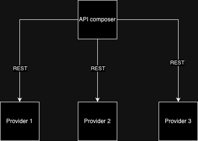

# Microservice

## 1. Tại sao nên sử dụng microservice:
### 1.1. Một số đặc điểm của việc sử dụng monolithic:
- Lợi ích:
  * Dễ dàng để phát triển do chỉ tập trung vào một ứng dụng.
  * Dễ dàng thay đổi code, database schema, build, deploy.
  * Dễ dàng để test do ứng dụng được phát triển để viết cho người dùng cuối.
  * Dễ dàng deploy do chỉ có duy nhất một file (package).
  * Dễ dàng scale do có thể chạy trên nhiều instance.
-> Nhưng việc phát triển, test, scale sẽ gặp nhiều vấn đề.
- Những hạn chế:
  * Mỗi lần thêm các feature làm cho code base càng ngày lớn hơn.
  * Khi code base càng lớn, độ phức tạp các code càng cao, càng khó hiểu, không thể dễ dàng debug, testing.
  * Quá trình phát triển phần mềm cũng tốn thời gian hơn do các giai đoạn edit, build, run, test đều kéo dài ra do sự ảnh hưởng của code base quá lớn.
  * Update các tính năng cho ứng dụng trở nên khó khăn hơn.
  * Vấn đề scaling cho từng module không còn đủ tương thích với từng nhiệm vụ của module.
  * Tính tin cậy của ứng dụng khi chạy cũng không đảm bảo do code base lớn, việc test trở nên khó khăn, khi có bug xảy ra thì các instance đều có thể đồng loạt sập.
  * Tech stack của ứng dụng không thể thay đổi.
### 1.2. Microservice giải vây:
- Sử dụng **monolithic** có nhiều vấn đề, trong đó những vấn đề lớn nhất là: khả năng mở rộng kém, các yêu cầu phi chức năng như testing, auth,... không thể được đảm bảo, từ đó ta đưa ra khái niệm **microservice**.
- Khái niệm **microservice**: ta sử dụng khái niệm scale cube của `Martin Abbott and Michael Fisher’s excellent book, The Art of Scalability` được định nghĩa thành 3 chiều scale khác nhau trong đó:
  * Chiều X: mở rộng thành nhiều **instance**, phân bố các request đều lên các **instance** khác nhau thông qua **load balancer**.
    
  * Chiều Z: giống chiều X, nhưng các **instance** lại đảm nhận lưu trữ một tập dữ liệu theo một đặc điểm nào nó như **userID**.
    
    
    -> Scale theo 2 chiều X và Z đều giúp đảm bảo khả năng sẵn có cũng như dung lượng nhưng không giải quyết được bài toán phát triển mở rộng hay code base quá phức tạp, và chúng ta có thêm scale chiều Z.
  * Chiều Y: được định nghĩa là phân bố **monolithic** thành các **services**, các **services** được định nghĩa là các ứng dụng nhỏ hơn của ứng dụng tổng thể, các service có thể được scale theo chiều X và có thể là cả chiều Y.
    
- Lợi ích của việc sử dụng kiến trúc microservice:
  * Có thể tích hợp các tính năng mới và phát triển ứng dụng một cách lâu dài
    * Thực hiện được các test yêu cầu bởi quá trình CD (continuous delivery/development) do các microservices nhỏ, các automated test dễ viết hơn và ít bug hơn.
    * Có thể thực hiện update liên tục được yêu cầu bởi quá trình CD do các microservices là độc lập, các teams có thể thực hiện liên tục các thay đổi tới ứng dụng mà không ảnh hưởng đến các services khác.
    * Quá trình phát triển mỗi team được chủ động và có liên kết lỏng lẻo (loosely coupled).
  * Mỗi service đều dễ bảo trì và kích thước nhỏ: do có code base ít nên dev có thể nắm bắt dễ hơn.
  * Mỗi service đều có thể scale một cách độc lập: các service đều có thể scale theo chiều X hoặc Z giống như ứng dụng monolithic, hơn thế các service được chạy trên các phần cứng phù hợp hơn, tối ưu hiệu suất.
  * Các service có thể xảy ra lỗi mà không ảnh hưởng đến các service khác.
  * Có thể thử nghiệm và phát triển các tính năng một cách dễ dàng: dev có thể tự do lựa chọn ngôn ngữ, framework để phát triển service.
- Hạn chế tồn tại:
  * Làm sao để phân chia các service là một bài toán khó.
  * Hệ thống phân tán rất phức tạp: các service có cách giao tiếp phức tạp hơn (interprocess communication mechanism) là chỉ gọi hàm như ứng dụng nguyên khối. Các service cũng phải xử lý được các lỗi khi liên lạc với các service khác.
  * Triển khai các tính năng cho service cần có sự tính toán hợp lý.
  * Chọn đúng thời điểm để chuyển qua kiến trúc microservice.
- Các pattern của microservices:
  *   Phân rã ứng dụng thành các services.
  *   Communication giữa các service: bao gồm communication style, discovery(làm sao để client có thể xác định được IP service cần dùng), reliability (làm sao để đảm bảo tính sẵn có giữa 2 services khi contact), transactional messaging (làm sao để thực hiện transaction db), external API (client contanct với service như nào?).
  *   Xử lý giao dịch: sử dụng Saga pattern.
  *   Truy vấn dữ liệu.
  *   Deploy service.
  *   Quản lý các service (log của serivce): health check API, log aggregation,...
  *   Autmated test: Consumer-driven contract test(service đạt được mong muốn của client), consumer-side contract test(client có thể liên lạc với service), service component test.
  *   Thực hiện các pattern obser và discovery tối ưu: Externalized Configuration pattern.
  *   Security.

## 2. Decomposition pattern:
### 2.1 By business capability:
- Phân chia theo năng lực, nghiệp vụ, những nhiệm vụ của công ty.
- Lợi ích của việc phân chia theo pattern này:
  * Phân chia các service sẽ ổn định nếu nghiệp vụ của công ty ổn định.
  * Có thể phân chia thành nhiều team độc lập với từng service.
  * Các service có liên hệ ít (loosely coupled).
- Ví dụ:
  * Công ty bán hàng thì thường có các nghiệp vụ quản lý hàng hóa, đơn hàng, vận chuyển,...
  * Công ty bảo hiểm quản lý các hợp đồng bảo hiểm, các gói bảo hiểm,...
  * Công ty an ninh mạng quản lý servers, các đối tượng cần bảo vệ,....
### 2.2. Subdomain:
- Định nghĩa bussiness thành một domain lớn.
- Chia domain thành các subdomain, các subdomain cũng gần giống với business capability.
- DDD gọi scope của các subdomain là bounded context, bounded context xác định được tập các service(s).
- Nhược điểm:
  * Có thể phân rã ra thành rất nhiều subdomain, tăng nhiều service rời rạc.
### 2.3. Transaction:
- Trong hệ phân tán, các transaction cần gọi 1 hay nhiều service để hoàn thành. Để giảm thiểu độ trễ, chúng ta gọi các service theo một transaction.
- Lợi ích:
  * Giảm thiểu thời gian chờ đợi.
  * Dữ liệu nhất quán.
- Nhược điểm:
  * Có thể tạo thành một ứng dụng nguyên khối phân tán.
  * Phức tạp hơn.
### 2.4. Team:
- Chia các service ra để cho từng team xây dựng và phát triển.
- Các team đều phải đảm bảo các qui tắc:
  * Nhỏ, chỉ từ 5-9 người.
  * Độc lập với các team khác.
- Lợi ích:
  * Các team hoàn toàn tự chủ mà không cần chờ đợi hay phụ thuộc vào team khác.
  * Từ một code base phức tạp như ứng dụng nguyên khối có thể phân rã thành các code base dễ hiểu hơn.
- Nhược điểm:
  * Khi phát triển các tính năng mới thì yêu cầu có nhiều team hơn hoặc các team phải tách ra độc lập.
### 2.5. Funtional:
- Phân chia hệ thống theo chức năng theo kiểu service hoặc module.
- Mỗi service chỉ đảm nhiệm duy nhất 1 chức năng.
- Ưu điểm:
  * Dễ dàng phân chia khi nghiệp vụ business nhỏ
- Nhược điểm:
  * Không phân chia service rõ ràng khiến cho service có thể xử lý hơn một chức năng.

### 3. Inter-process communication:
### 3.1. Communication style:
- Được phân loại thành 2 chiều khác nhau.
- Loại 1:
  * One-to-one: từng client request chỉ được xử lý bởi một service.
  * One-to-many: từng client request được xử lý bởi nhiều service.
- Loại 2:
  * Synchronous: client gửi request và chờ đợi nhận được response và có thể bị block.
  * Asynchronous: client không block, gửi request và response có thể không cần gửi ngay.
#### Có thể được so sánh bởi bảng sau:
|          | One-to-one | One-to-many | 
| ------------- | ------------- | --------- |
| Synchronous  | Request/Response  | x |
| Asynchronous | Asynchronous reqeust/response or One-way notification  | Publish/subscribe or Publish/async responses |
- Các term có thể được giải thích như sau:
  * Request/Response: Client gửi request lên service và chờ response, trong quá trình đó thì có thể client bị block.
  * Asynchronous reqeust/response: Client gửi request lên service và service không cần trả lời ngay, client không bị block.
  * One-way notification: Client gửi request lên service và không cần nhận phản hồi từ service.
  * Publish/subscribe: Client gửi nhiều request, được đọc bởi một hay nhiều services.
  * Publish/async responses: Client gửi request và chờ khoảng thời gian để nhận phản hồi từ services mong muốn.
### 3.2. Synchronous:
#### 3.2.1. Sử dụng REST:
- Ưu điểm:
  * Đơn giản và dễ làm quen.
  * Có thể kiểm thử HTTP API thông qua trình duyệt, postman,...
  * Hỗ trợ kiểu giao tiếp request/response.
  * Tương thích đa số firewall hiện thời.
  * Hệ thống tương đối đơn giản do không có trung gian để thực hiện request/response.
- Nhược điểm:
  * Chỉ support kiểu giao tiếp request/response.
  * Giảm khả năng sẵn có do không có trung gian đứng ra để buffer request, dẫn tới có thể mất gói tin khi vận chuyển qua đường truyền mạng.
  * Client phải biết được URL của service instance.
  * Lấy nhiều dữ liệu từ nhiều service khác nhau là bài toán khó.
  * Khó trong việc đặt tên các operation có cùng chức năng nhưng khác mục đích (POST).
#### 3.2.2. Sử dụng gRPC
- Sử dụng binary message nên có hiệu năng cao, nhỏ, hiệu quả.
- Sử dụng HTTP/2.
- Ưu điểm:
  * Khắc phục yếu điểm của REST khi có thể thiết kế nhiều API cùng operation nhưng khác mục đích.
  * Hiệu năng tốt, đặc biệt là khi trao đổi các msg có dung lượng lớn.
  * Streaming ở cả client và server.
  * Client hoặc server đều có thể viết bằng các ngôn ngữ lập trình khác nhau mà vẫn có thể gửi request/response.
- Nhược điểm:
  * JavaSciprt client phải thực hiện nhiều thao tác hơn để xử lý msg của gRPC thay vì là REST.
  * Những firewall cũ có thể không tương thích với HTTP/2.
### 3.3. Asynchronous
#### 3.3.1. Message
- Các services sẽ contact với nhau thông qua message.
- Sẽ có thành phần trung gian là message-broker để trao đổi message.
- Một message sẽ bao gồm phần header và phần body:
  * Header: tập hợp các cặp name:value để mô tả dữ liệu cần gửi.
  * Body: là dữ liệu cần, có thể ở dạng text hoặc binary.
- Một số kiểu message:
  * Document: Chỉ chứa dữ liệu cần gửi.
  * Command: chứa operation và parameter để thực hiện hành động nào đó.
  * Event: Các event có thể xảy ra ở phía sender.
#### 3.3.2. Channel:
- Message được trao đổi thông qua channel.
- Mỗi bên sender hay reciever đều có sending port và recieve port để thực hiện push hay pull dữ liệu từ message channel.
- Có 2 kiểu channel:
  * Point-to-point: vận chuyển message đến đúng một consumer đang đọc từ message channel. Command message thường sử dụng loại channel này. Thường là style one-to-one communication.
  * Publish-subcribe: vận chuyển từng message đến từng consumers đang đọc từ message channel. Event message thường sử dụng loại channel này. Thường là style one-to-many communication.
#### 3.3.3. Xây dựng communication style dựa trên message:
##### 3.3.3.1. Request/Response and Async Request/Response:
- Sự khác biệt chính của 2 kiểu communication này là:
  * Request/Response có thể client bị block để chờ response.
  * Async Request/Response không chờ response, client không bị block.
- Message channel sử dụng ở đây là point-to-point.
- Bằng cách exchange các message, chỉ rõ command cần thực hiện và các tham số cần truyền vào đến request channel của service, service xử lý xong thì gửi kết quả về response channel của client.
- Client phải chỉ rõ location response channel bằng cách đính kèm thông tin location vào header của request và message id gửi đi, service xử lý thì đính kèm thêm **correlation id** để match response message với request nào bằng cách so sánh với message id.
##### 3.3.3.2. One-way-notification:
- Client chỉ gửi request đến point-to-point message channel và service lấy chúng xử lý mà không cần phản hồi lại.
##### 3.3.3.3. Publish/subscribe:
- Client publish message lên publish-subscribe channel và được đọc bởi các consumers.
- Thường được sử dụng kiểu message là event, nhận biết sự thay đổi của domain objects.
##### 3.3.3.4. Publish/Async response:
- Kết hợp các thành phần publish/subscribe và request/response.
- Client thực hiện publish message chỉ định rõ reply channel trong header rồi gửi tới publish/subscribe channel. Consumer thực hiện gửi response kèm theo **correlation id** để match với từng request.
### 3.3.4. Message broker:
- Sender sẽ thực hiển đẩy message vào message broker, message broker chuyển message tới receiver.
- Lợi ích:
  * Sender không cần biết location của receiver và các message vẫn được buffer cho đến khi được đọc bởi receiver.
  * Loose coupling: client chỉ cần push request vào đúng message broker mà không cần biết tới service instance nào.
  * Flexible: có thể trao đổi nhiều kiểu message khác nhau.
  * Quá trình giao tiếp rõ ràng.
- Nhược điểm:
  * Có thể bị thắt cổ chai.
  * Quá tải tại điểm nút.
  * Hệ thống trở nên phức tạp hơn

## 4. API Gateway:
### 4.1. Vấn đề cách gọi API ứng dụng monolithic sang microservice:
- Trải nghiệm không tốt do client phải gửi request lên service nhiều: môi trường mạng thực tế có latency cao gấp 100 lần so với mạng LAN nội bộ, ngoài ra việc gửi request còn gây hao phí tài nguyên.
- Sự thay đổi của endpoint API có thể gây ảnh hưởng tới các client chưa được cập nhật.
- Service có thể sử dụng các IPC không quen thuộc, ví dụ client hay sử dụng REST nhưng service lại sử dụng gRPC.
### 4.2. API Gateway pattern:
- API Gateway là entry point cho các request ở ngoài môi trường mạng. Nó đảm nhiệm việc routing, API Compositing, một số edge function như authentication.
#### 4.2.1. Tổng quan chức năng của API Gateway:
- Request routing: khi nhận được request, API Gateway sẽ thực hiện đọc routing map để xác định service nào serve request đó.
- API Composition: client chỉ gần gửi 1 request và API Gateway gọi đến các service cần thiết và gộp các kết quả lại để trả về cho client.
- Protocol translation: hỗ trợ nhiều protocol khác nhau, có thể là REST hoặc gRPC.
- Mỗi client lại có một API Gateway khác nhau do yêu cầu về lượng dữ liệu cần lấy là khác nhau.
- Các edge function:
  * Authen/Author: thực hiện xác thực/phân quyền user.
  * Rate limiting: limit số request/s mà người dùng có thể thực hiện.
  * Caching: giảm số lượng request bằng cách sử dụng cache.
  * Metris collection: thực hiện phân tích số lượng request tới API nào đó.
  * Request log.
#### 4.2.2. API Gateway architecture:

- Có 2 layer chính:
  * API layer: chứa các API của từng client.
  * API gateway(common function): các function dùng chung của cả client.
#### 4.2.3. Ownership model:

- Các team sẽ tự đảm nhận API.
- Team API Gateway sẽ đảm nhận common function.
#### 4.2.4. Backend for frontend:

- Giống với ownership model, nhưng giờ đây với mỗi API team sẽ giữ cả nhiệm vụ quản lý API Gateway.
- Lợi ích:
  * Tăng khả năng tin cậy do các API module độc lập với nhau.
  * Có thể scale một cách độc lập.
  * Giảm thời gian startup.
- Nhược điểm:
  * Duplicate code do API module nào cũng có common function nếu sử dụng tech stack khác nhau.
### 4.3 Ưu và nhược điểm của API Gateway:
- Ưu điểm:
  * Đảm bảo tính chất đóng gói của ứng dụng, chỉ expose gateway cho người dùng sử dụng.
  * Giảm round-trip giữa client với application.
  * Giảm độ phức tạp của code.
- Nhược điểm:
  * API Gateway có thể trở thành điểm nghẽn.
  * Thêm một thành phần cần phát triển.
### 4.4. Implement API Gateway
- Hiệu năng và khả năng scale:
  * Key design: Synchronous hay asynchronous I/O.
  * Synchronous I/O model: mỗi kết nối mạng là một thread. Điểm trừ là thread nặng nên có giới hạn.
  * Asynchronous (nonblocking) I/O model: một vòng lặp thread sẽ xử lý các requests. Có thể scale vì không phụ thuộc vào số lượng thread nhưng code sẽ phức tạp hơn.
- Sử dụng API Composition: bằng cách viết code một cách concurrent, rồi tổng hợp lại kết quả trả về cho client do các service gọi độc lập với nhau.
- Handling partial failures: Chạy nhiều instances API Gateway ở sau load balancer hoặc sử dụng **Circuit breaker pattern** để dựa vào các request trước để xác định request hiện tại có nên thực hiện hay không.
- Service discovery: xác định được location của instance service để invoke request của client.
- Service invocation: API Gateway cần hỗ trợ nhiều giao thức giao tiếp với service.

## 5. Data management:
### 5.1. API compostition pattern: 
- Có hai thành phần chính:
  * API Composer: thực hiện request đến các service cần thiết để lấy dữ liệu và gộp các dữ liệu với nhau. API Composer có thể là client (web) hay là API Gateway và pattern Backends for frontends. 
  * Provider service: service chứa dữ liệu cần trả về.

- Việc sử dụng pattern này bị ảnh hưởng bởi một số yếu tố như dữ liệu được phân chia như nào, API được expose như nào, thẩm quyền ra sao.
- Các bước thực hiện bao gồm:
  * Client gọi đến endpoint của API Composer, API Composer thực hiện operation query bằng cách gọi đến các endpoint của các provider services cần thiết.
  * Các provider service trả về kết quả và API Composer sẽ thực hiện gộp các kết quả lại và trả về cho client.
- Một số vấn đề của pattern:
  * API Composer có thể là client(web), API Gateway hoặc là một service độc lập(ưu tiên cách này).
  * API Composer nên implement operation query một cách concurrent do các lần lấy dữ liệu là độc lập với nhau
- Ưu điểm:
  * Rất đơn giản để hiểu và implement.
- Nhược điểm:
  * Tăng chi phí thực hiện: do thực hiện nhiều request lên các provider service sẽ tốn chi phí hơn là chỉ thực hiện 1 request giống với ứng dụng monolithic.
  * Giảm tính sẵn sàng: availability operation liên quan đến số lượng services gửi mà API Composer gửi request đến. Càng nhiều service thì mức độ avaibility giảm xuống. Có một số giải pháp như sau:
    * Lưu cache của các lần request để đảm bảo nếu có provider service nào đó offline thì vẫn có kết quả trả về.
    * Hiển thị thiếu thông tin của service offline.
  * Dữ liệu có thể không nhất quán giữa các service do các service có database là độc lập.
### 5.2. CQRS pattern:
- CQRS là cách nhân bản database để phục vụ 2 mục đích khác nhau là: (command-CUD) và query(R).
- Tại sao lại sử dụng CQRS mà không phải API composition:
  * Một số query không phù hợp để apply API composition. Một số complex query yêu cầu sort hay filter theo trường dữ liệu nào đó, nhưng các services có thể không có trường dữ liệu cần thiết để thao tác như đã đề cập ở trên, nếu apply API composition thì phải join nhiều bằng cùng một lúc, chi phí thực hiện rất tốn kém hoặc thực hiện tối ưu truy vấn bằng cách lọc dần ra các bản ghi theo điều kiện nhưng cũng gây traffic network.
  * Một service lưu trữ dữ liệu không có nghĩa service ấy nên thực hiện query. Mỗi service chỉ nên đảm nhiệm một chức năng duy nhất, một số query yêu cầu có database hỗ trợ lưu trữ một số kiểu dữ liệu đặc biệt như geo,...

- Cấu trúc của CQRS pattern:
  * Phân tách data model và module thành 2 phần: commmand và queries:
    * Phần command đảm nhiệm thực hiện các thao tác lên database như CUD.
    * Phần query đảm hiện thực hiện truy vấn phức tạp.
  * Data model bên query đảm bảo cho dữ liệu luôn up-to-date bằng cách đồng bộ với data model bên command, subscribe các event được publish bởi phía command.
- Service không sử dụng pattern CQRS:
  * Các operation chủ yếu được implement bằng cách các data model được map tới database.
  * Một số query thì được bypass để đảm bảo hiệu năng.
  * Một database duy nhất hỗ trợ đầy đủ CRUD.
- Service có sử dụng pattern CQRS:
  * Bên phía command sẽ đảm nhận CUD operation và map tới database của bên phía command. Ngoài ra bên command cũng xử lý một số query đơn giản như query theo primary key, không join nhiều bảng,.....
  * Bên command sẽ thực hiện publish các event bên phía query để đảm bảo dữ liệu được up-to-date.
  * Phía query thực hiện các queries phức tạp hơn. Database phục vụ cho queries có thể có một số đặc điểm đặc thù để phù hợp cho query với một số kiểu dữ liệu.
  * Phía query đồng thời cũng nhận các event của bên phía command và thực hiện update.

- Không chỉ apply pattern này vào 1 service, mà ta có thể tạo một service độc lập chỉ phục vụ query áp dụng theo pattern CQRS. Các service có lưu trữ dữ liệu liên quan đến service query sẽ push event lên service query để update database. Service query cũng chỉ implement các query, được cài đặt database phục vụ cho một số mục đích như geo search, full-text search,...
- Ưu điểm:
  * Tối ưu hơn trong việc truy vấn: một số query nếu được implement bằng API Composition sẽ phải join nhiều bảng gây lãng phí tài nguyên tính toán, ngoài ra một só database hỗ trợ một số tính năng giúp query nhanh hơn.
  * Giải quyết được vấn đề của event-souring: do event-store chỉ hỗ trợ query đơn giản, CQRS khắc phục yếu điểm của event-source nên 2 pattern này thường đi với nhau.
  * Phân tách được vai trò command và query: domain model sẽ không phải gánh 2 trách nghiệm command và queries, thay vào đó CQRS sẽ phân chia command riêng, query riêng giúp code dễ maintain hơn. Ngoài ra, việc define service lưu trữ dữ liệu và service query giúp đảm bảo tính chất một service chỉ nên thực hiện một nhiệm vụ.
- Nhược điểm:
  * Tăng độ phức tạp của hệ thống: implement publish/subscribe, bảo trì nhiều database hơn, các database phục vụ query có thể không giống database sử dụng command.
  * Replication lag: khi thực hiện lập command trước mà lập tức query, có khả năng người dùng sẽ thấy version dữ liệu trước, không phải dữ liệu mới được update. Một cách giải quyết là thông báo cho người dùng về việc dữ liệu này là dữ liệu cũ, có thể thử lại cho đến khi thấy được dữ liệu mới.

## 7. Configuration management:
- Một service thường chứa 2 thành phần:
  * Infrastructure: service registry, database,...
  * 3-rd party service: mail, log, health,....
- Vấn đề:
  * Service cần phải biết kết nối đến các thành phần.
  * Service phải chạy được nhiều môi trường không cần phải sửa đổi image.
- Giải pháp:
  * Tách biệt config và source code, khi thực hiện chạy service, truyền vào config tuỳ thuộc vào môi trường dev.
